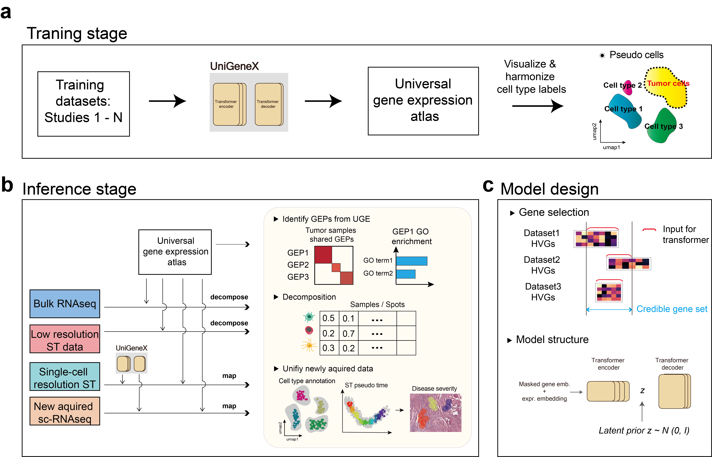

.. UniGeneX documentation master file, created by
   sphinx-quickstart on Fri Apr 24 19:33:14 2026.
   You can adapt this file completely to your liking, but it should at least
   contain the root `toctree` directive.

UniGeneX documentation
======================

   
.. toctree::
   :maxdepth: 2
   :caption: Contents:

   Installation
   Atlas_data_preprocessing
   Preparing_training_input
   Training
   UGE_output
   Newly_comming_data

   
UniGeneX is a single-cell foundation model designed to construct a comprehensive UGE atlas to uncover the underlying cell state transitions and associated microenvironment in human diseases. The framework consists of two main stages, training and inference, and three novel features: context-specific, interpretable and actionable. It can serve as a comprehensive single-cell reference dataset that integrate multiple data type and perform various downstream analyses. For example, the deconvolution of bulk RNA-seq data and spatial transcriptomics data with various resolution. By integrating highly an interpretable UGE atlas with spatial transcriptomics data, UniGenX provide a powerful framework for deciphering cell state transitions during disease progression and their associated microenvironmental changes.