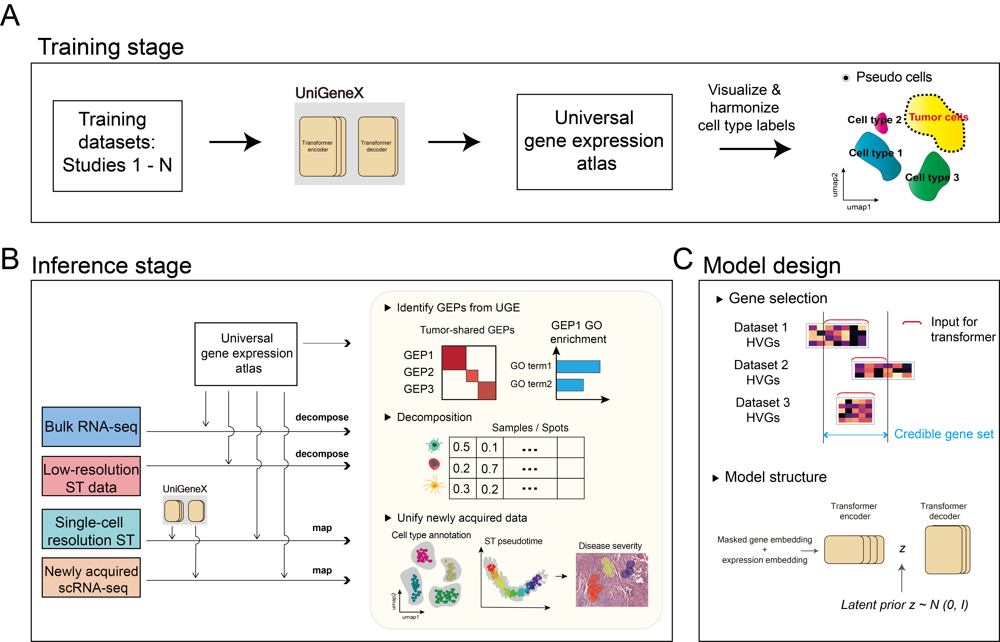

UniGeneX documentation
======================

UniGeneX is a single-cell foundation model for constructing a universal gene
expression (UGE) atlas and studying cell-state transitions and their associated
microenvironments in human disease. The framework has two stages, training and
inference, and is designed to be context-specific, interpretable and actionable.

   Overview of the UniGeneX training and inference workflow and model design.

The UGE atlas provides a comprehensive single-cell reference for integrating
multiple data types and performing downstream analyses, including bulk and
spatial-transcriptomics decomposition and atlas mapping of newly acquired data.

Documentation contents
----------------------

.. toctree::
   :maxdepth: 2

   Installation
   Atlas_data_preprocessing
   Preparing_training_input
   Training
   UGE_output
   Newly_comming_data
   Pulmonary_fibrosis
